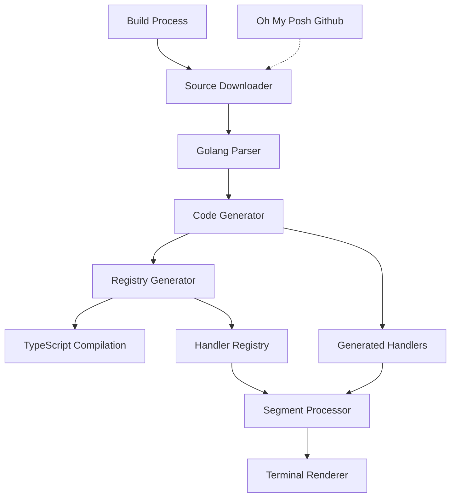

# Dynamic TypeScript Code Generation for Oh My Posh Segments

This documentation describes the implementation of a build-time process to dynamically generate TypeScript functions and complementary code from the Oh My Posh golang codebase.

## Overview

The Oh My Posh Terminal React Component needs to accurately render all segment types that are available in the original Oh My Posh golang implementation. Rather than manually implementing each segment handler, we've created a system that automatically generates TypeScript code from the Oh My Posh golang source at build time.

This approach ensures:
1. Complete feature parity with Oh My Posh
2. Automatic updates when Oh My Posh adds or modifies segments
3. No manual maintenance of a parallel codebase
4. Type-safe integration with the React component

## Architecture

The system consists of several components:

1. **Source Downloader**: Downloads the Oh My Posh golang source code
2. **Golang Parser**: Analyzes the golang code to extract segment implementations
3. **Code Generator**: Transforms parsed golang code into TypeScript
4. **Registry Generator**: Creates a registry of all segment handlers
5. **Build Integration**: Integrates the generation process with the build system



## How It Works

1. During the build process, the script downloads the Oh My Posh golang source code
2. It analyzes the segment implementation files to extract:
   - Properties and their types
   - Templates used for rendering
   - Functions that determine segment behavior
3. For each segment, it generates:
   - TypeScript interface extending the base segment types
   - A handler class that processes segments according to their type
   - Helper functions for template resolution and conditional logic
4. It creates a registry of all segment handlers to be used by the SegmentProcessor
5. The generated code is then used by the React component to render segments

## File Structure

```
scripts/
  ├── generateSegmentCode.ts        # Main script for code generation
  └── utils/
      ├── sourceDownloader.ts       # Downloads Oh My Posh source
      ├── golangParser.ts           # Parses golang segment implementations
      ├── codeGenerator.ts          # Generates TypeScript code
      └── registryGenerator.ts      # Creates registry of segment handlers

src/
  ├── segments/
  │   └── handlers/                 # Generated segment handlers
  │       ├── index.ts              # Auto-generated registry
  │       └── *.ts                  # Individual segment handlers
  ├── types/
  │   └── generatedSegments.d.ts    # Generated type definitions
  └── mocks/
      └── segmentProcessor.ts       # Uses generated segment handlers
```

## Usage

The system is integrated into the build process. When you run `npm run build`, the code generation automatically happens before TypeScript compilation:

```bash
# Run full build with code generation
npm run build

# Skip code generation for faster builds during development
npm run build:fast

# Generate segment code manually
npm run generate:segments
```

## Extending and Customizing

### Overriding Generated Handlers

You can create custom handlers that override the generated ones:

1. Create a file in `src/segments/custom/` with the same name as the generated handler
2. Implement the same interface but with your custom logic
3. Import and register your custom handler in the segment processor

### Adding New Segment Types

If Oh My Posh adds new segment types, they will be automatically picked up during the next build. No manual intervention is required.

### Customizing the Generation Process

If you need to customize how code is generated:

1. Modify the appropriate utility in `scripts/utils/`
2. Add special handling for specific segment types in `codeGenerator.ts`
3. Run `npm run generate:segments` to apply your changes

## Troubleshooting

### Common Issues

1. **Missing segment handlers**: Verify that the Oh My Posh source was downloaded correctly
2. **Type errors**: Check that the generated types match the expected interface
3. **Template resolution errors**: Debug the template resolver implementation

### Debugging

Add environment variables for more verbose output:

```bash
# Enable debug logging
DEBUG=true npm run generate:segments

# Force regeneration of files
FORCE_GENERATE=true npm run generate:segments
```

## Related Documentation

- [Segment Types](./segments/segmenttypes.md) - List of all available segment types
- [Mock System](./mocksystem.md) - How the mocking system works with generated segment handlers
