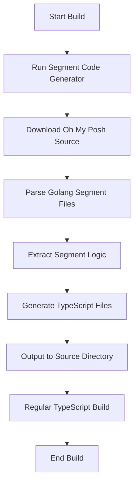
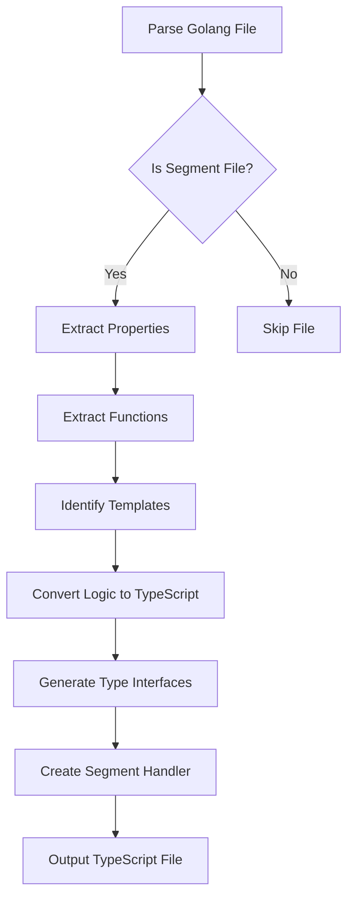
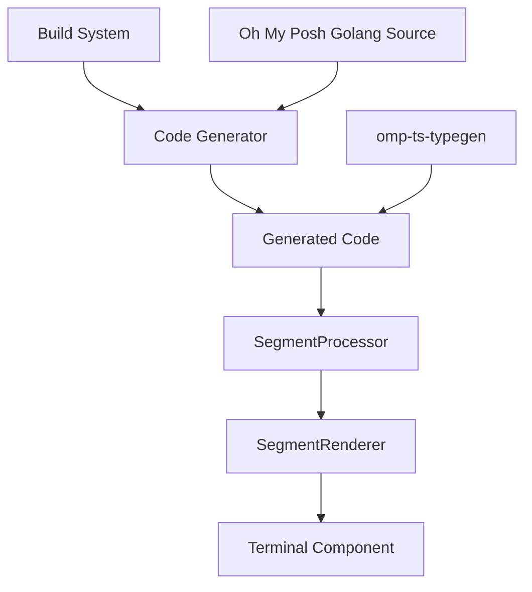

# Dynamic TypeScript Code Generation for Oh My Posh Segments

## Overview

This task implements a build-time process to dynamically generate TypeScript functions and complementary code for all segments from the Oh My Posh golang codebase. The goal is to extend the existing `omp-ts-typegen` types without manually maintaining a parallel codebase. This approach ensures that the React component can accurately represent and process all segment types defined in the Oh My Posh golang source, keeping segment functionality in sync with the original implementation.

## Implementation Plan

We'll create a build-time script that:

1. Fetches the Oh My Posh golang source code
2. Analyzes the segment implementations
3. Extracts segment functionality, properties, and behavior patterns
4. Generates TypeScript interfaces, functions, and helper code
5. Outputs these as TypeScript files in the appropriate directories
6. Integrates with the existing build process

### Core Components

1. **Segment Code Generator**: A Node.js script that extracts segment implementations from the Oh My Posh golang codebase and generates equivalent TypeScript functions
2. **Build Process Integration**: Updates to the build scripts to run the code generator before the TypeScript compilation
3. **Type Extensions**: Dynamically generated interfaces that extend the base types from `omp-ts-typegen`
4. **Segment Handlers**: Individually generated segment processing functions that replicate the logic of the golang segment implementations
5. **Registry System**: An automatically generated registry of all segment handlers to be used by the SegmentProcessor

## Technical Details

### Dependencies

- `@rbleattler/omp-ts-typegen` - Existing package with base types
- `node-fetch` - For downloading Oh My Posh golang source
- `@types/node` - TypeScript types for Node.js
- `fs-extra` - Enhanced file system operations
- `glob` - Pattern matching for files

### Build Process Flow

### File Generation Process

### System Architecture

## Code Changes

### New Files

1. `scripts/generateSegmentCode.ts` - Main code generator script
2. `scripts/utils/golangParser.ts` - Utilities for parsing golang source
3. `scripts/utils/typeGenerator.ts` - Utilities for generating TypeScript types
4. `scripts/utils/codeGenerator.ts` - Utilities for generating TypeScript code
5. `src/types/generatedSegments.d.ts` - Type declarations for generated segment handlers
6. `src/segments/handlers/index.ts` - Auto-generated registry of segment handlers
7. `src/segments/handlers/*.ts` - Individual segment handler files (one per segment type)

### Modified Files

1. `package.json` - Add build scripts and dependencies
2. `src/mocks/segmentProcessor.ts` - Update to use dynamically generated segment handlers
3. `src/components/segmentRenderer.tsx` - Enhance with the generated segment capabilities

## Testing Plan

1. **Unit Tests**:
   - Test code generator functionality
   - Test generated segment handlers
   - Test integration with existing components

2. **Snapshot Tests**:
   - Compare output of generated code with expected output
   - Ensure code generation is deterministic

3. **Integration Tests**:
   - Test segment rendering with generated handlers
   - Ensure behavior matches expected Oh My Posh output

4. **Manual Testing**:
   - Visual verification of segment rendering
   - Comparison with native Oh My Posh output

## Challenges and Considerations

1. **Golang to TypeScript Conversion**: Converting golang code patterns to equivalent TypeScript could be challenging, especially for complex logic.

2. **Unsupported Features**: Some features in golang may not have direct equivalents in TypeScript/JavaScript.

3. **Template Resolution**: Oh My Posh uses a template system that needs to be properly translated into a React-compatible approach.

4. **Versioning**: Need to maintain compatibility with the specific Oh My Posh version that `omp-ts-typegen` was generated from.

5. **Performance**: Code generation should be efficient and not significantly impact build times.

## Rollback Plan

If issues arise with the generated code:

1. Disable the code generation step in the build process
2. Revert to the previous segment handler implementation
3. Add manual implementations for any critical segments
