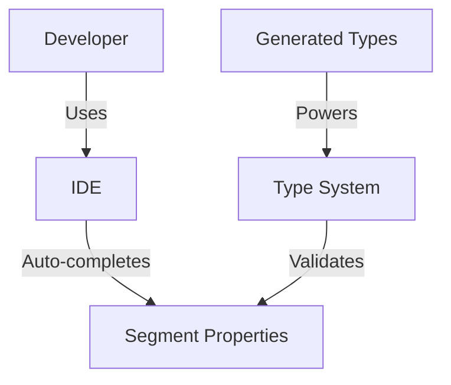

# User Stories for Dynamic TypeScript Code Generation

## User Story 1: Developer Integration

**Title**: Seamless Integration with Oh My Posh Updates

**As a**: Developer of the omp-terminal-react-component

**I want**: The component to automatically adapt to changes in the Oh My Posh golang codebase

**So that**: I don't have to manually update TypeScript code every time Oh My Posh adds or modifies segments

**Acceptance Criteria**:
- Build process automatically generates TypeScript code from the latest Oh My Posh golang source
- No manual intervention required when new segments are added to Oh My Posh
- Generated code correctly extends the omp-ts-typegen types
- Build fails with clear error messages if code generation encounters issues

**Notes**:
- This significantly reduces maintenance burden for keeping the component in sync with Oh My Posh

## User Story 2: Feature Parity

**Title**: Complete Segment Feature Support

**As a**: End-user of the omp-terminal-react-component

**I want**: All segments from Oh My Posh to work correctly in the React component

**So that**: My terminal theme appears identical to my native Oh My Posh setup

**Acceptance Criteria**:
- Each segment type renders with the correct appearance and behavior
- Segment properties like colors, icons, and text are properly applied
- Conditional rendering based on segment properties works as expected
- Special cases (like Git status, battery levels, etc.) are handled correctly

**Notes**:
- This ensures that users don't have to compromise on features when using the React component

## User Story 3: Type Safety

**Title**: TypeScript Type Safety for Generated Code

**As a**: Developer using the omp-terminal-react-component in their project

**I want**: Full TypeScript type safety for all segment types and properties

**So that**: I get proper IDE completion and type checking when customizing segments

**Acceptance Criteria**:
- Generated TypeScript interfaces accurately represent segment properties
- Type definitions are comprehensive and well-documented
- IDE auto-completion works for all segment types and properties
- Type errors correctly flag invalid segment configurations

**Screenshots/Diagrams**:

**Notes**:
- This improves developer experience when working with the component

## User Story 4: Build Performance

**Title**: Efficient Build Process

**As a**: Developer building a project using omp-terminal-react-component

**I want**: The code generation process to be efficient and fast

**So that**: Build times aren't significantly increased by the code generation step

**Acceptance Criteria**:
- Code generation adds no more than 10 seconds to the build process
- Generated code is cached when possible to avoid unnecessary regeneration
- Clear logs of the code generation process are available for debugging
- Option to skip code generation with pre-built files for faster development builds

**Notes**:
- Development experience is important, so the build process should remain fast

## User Story 5: Extensibility

**Title**: Easily Extend Generated Code

**As a**: Developer customizing omp-terminal-react-component

**I want**: A clean way to extend or override generated segment handlers

**So that**: I can add custom behavior without modifying generated code

**Acceptance Criteria**:
- Clear documentation on how to extend or override generated segment handlers
- Extension points available for customizing segment behavior
- Custom handlers take precedence over generated ones when both exist
- Extensions persist across code regeneration

**Notes**:
- This allows for specific customizations while still benefiting from the generated code
