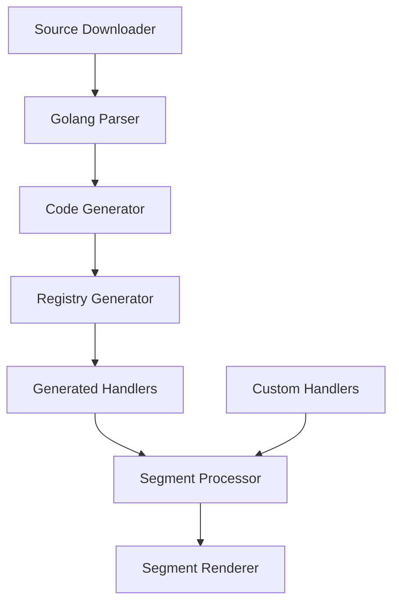
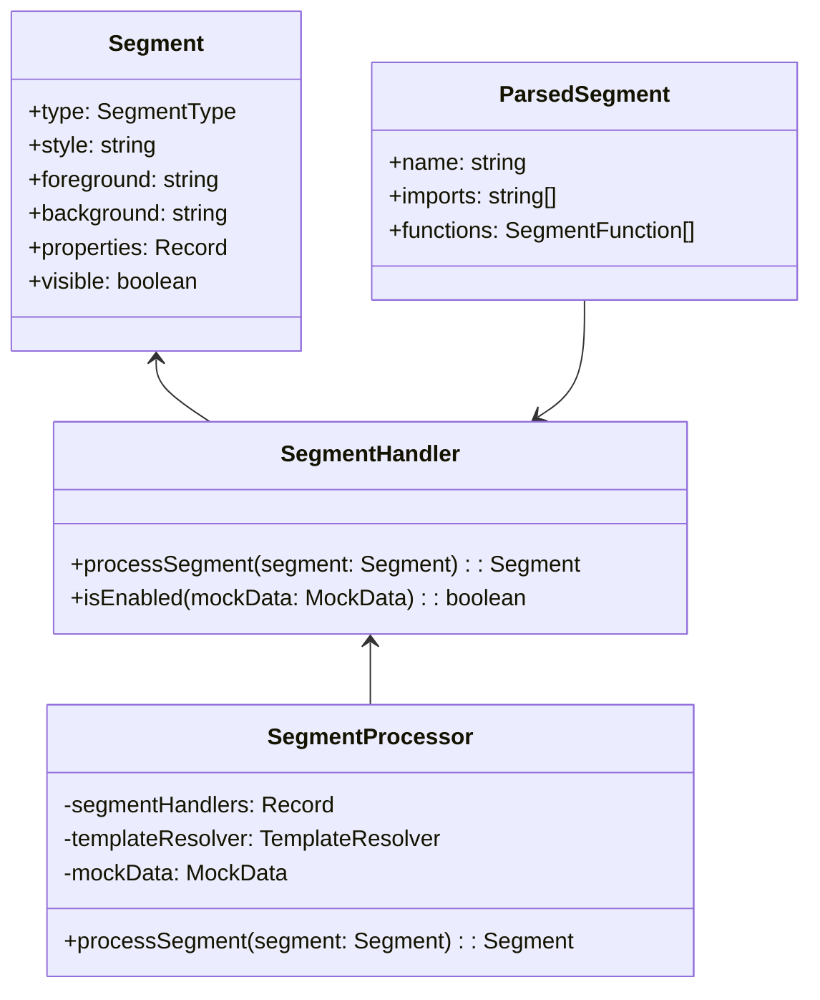

# Implementation Plan: Fix TypeScript Errors in Dynamic Code Generation System

## Overview

The Oh My Posh Terminal React Component codebase currently has multiple TypeScript errors that need to be addressed to ensure proper functioning of the dynamic code generation system. These errors span across various parts of the codebase, from the code generation utilities to the test files and example components.

The purpose of this task is to fix all these errors while maintaining the existing functionality, ensuring type safety throughout the codebase, and improving the overall quality and maintainability of the code.

## Implementation Plan

The implementation will focus on addressing five main categories of issues:

1. **Null/undefined handling issues**: Add proper null checks and type guards
2. **Type safety problems**: Fix incompatible type assignments and comparisons
3. **Module resolution errors**: Ensure proper module imports and exports
4. **Property access on potentially undefined objects**: Add null checks before accessing properties
5. **Missing required properties**: Add missing required properties to objects

### Approach

1. Address issues in utility files first (sourceDownloader, golangParser, codeGenerator, registryGenerator)
2. Fix segment handler implementations (gitHandler, custom handlers)
3. Resolve test file issues
4. Address example component errors
5. Update type definitions and ensure consistency across the codebase

## Technical Details

### TypeScript Strict Mode Compliance

Many of the errors in the codebase are related to TypeScript's strict type checking. Our approach will ensure strict mode compliance by:

1. Adding appropriate non-null assertions (`!`) only when we can guarantee a value is not null
2. Using type guards to narrow types before accessing properties
3. Adding default values where appropriate
4. Using optional chaining (`?.`) for safer property access

### Module Resolution

Module resolution issues will be addressed by:

1. Ensuring all necessary modules are exported correctly
2. Making sure barrel files (index.ts) export all required types and functions
3. Using proper relative import paths
4. Creating any missing type definition files

### Test Improvements

For test files, we will:

1. Fix type mismatches in test assertions
2. Add proper type annotations for test data
3. Use type-safe mocking approaches
4. Add missing properties to test objects

## Relationship Diagrams

### Dynamic Code Generation System Flow

### Type Relationships

## Code Changes

### 1. Fix golangParser.ts TypeScript Errors

The golangParser.ts file has multiple issues with handling undefined values and type assertions. The changes will include:

- Add null checks before accessing object properties
- Properly handle `string | undefined` types with default values or type guards
- Use non-null assertions only when we can guarantee values are not null

### 2. Fix codeGenerator.ts Type Issues

The codeGenerator.ts file has type mismatches that need to be addressed:

- Fix the incompatibility between ParsedSegment and SegmentFunction[]
- Ensure the functions property exists and is properly typed
- Add explicit type annotations for parameters

### 3. Fix Module Resolution Errors

Ensure proper module exports and imports:

- Create/update index.ts files to export all required components
- Fix import paths in segmentProcessor.ts and test files
- Add missing type declarations

### 4. Fix Property Access Issues in Handlers

Address property access errors in segment handlers:

- Add null checks before accessing properties
- Use optional chaining for safer property access
- Add type guards to narrow types before accessing properties

### 5. Fix Test File Errors

Address test file issues:

- Fix argument types in test assertions
- Add null checks for potentially undefined objects
- Ensure test objects have all required properties

### 6. Fix Example Component Errors

Fix errors in example components:

- Add required style property to segment objects
- Fix type mismatches in mock data
- Ensure proper imports and exports

## Testing Plan

### Unit Tests

1. Update and fix existing unit tests for all utility functions:
   - sourceDownloader.test.ts
   - golangParser.test.ts
   - codeGenerator.test.ts
   - registryGenerator.test.ts

2. Ensure segment handler tests pass:
   - Test custom segment handler overrides
   - Test segment processor integration

### Integration Tests

1. Fix and enhance segmentRenderer.test.tsx to ensure proper integration with the segment processor
2. Add tests for the example components to verify they work correctly

### Manual Testing

1. Run the example application to verify everything works as expected
2. Test the dynamic code generation system with various segment types
3. Verify custom handlers correctly override generated handlers

## Risks and Mitigations

### Risks

1. **Type changes may break existing functionality**: Changes to types might cause unexpected behavior changes
2. **Interdependencies between components**: Fixing one issue might reveal or create others
3. **Test coverage gaps**: Some areas may not be well covered by tests

### Mitigations

1. Make incremental changes and test after each change
2. Use TypeScript's type system to catch issues early
3. Add additional tests for areas with limited coverage
4. Document any non-obvious type assertions or workarounds

## Timeline

1. **Day 1**: Fix utility files (sourceDownloader, golangParser, codeGenerator, registryGenerator)
2. **Day 1**: Fix segment handler implementations
3. **Day 2**: Fix test files
4. **Day 2**: Address example component errors
5. **Day 2**: Final testing and documentation updates
