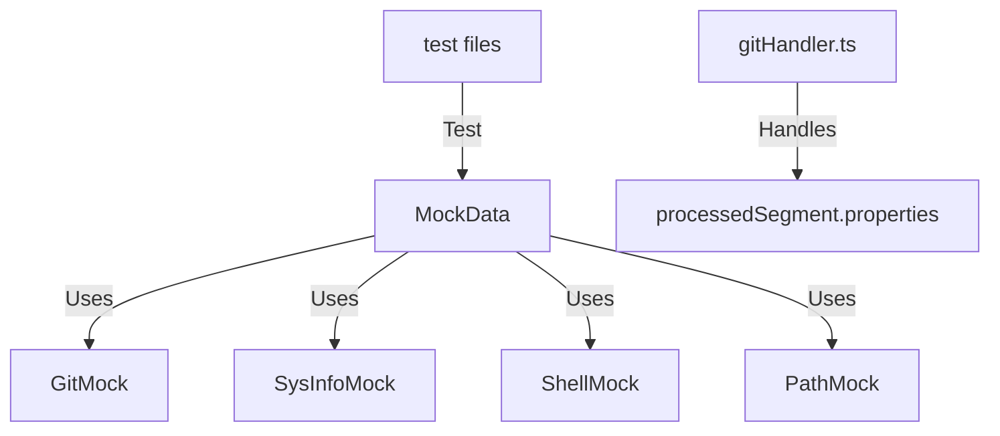

# Implementation Plan

## Overview
This task involves fixing build issues and ensuring the codebase adheres to the provided coding instructions. The fixes include resolving type mismatches, handling undefined properties, and updating test files to ensure compatibility with the latest changes.

## Implementation Plan
1. **Fix Missing Type Definitions**:
   - Add definitions for `GitMock`, `SysInfoMock`, `ShellMock`, and `PathMock` in `.scratch/MockData.ts`.

2. **Align `MockData` Types**:
   - Ensure the `env` property in `MockData` has a consistent type across the codebase.

3. **Handle Undefined Properties**:
   - Use optional chaining or default values to handle `processedSegment.properties` in `gitHandler.ts`.

4. **Fix Test Files**:
   - Update test files to include the required `style` property in `Segment` objects.
   - Correct argument types in test cases.

5. **Update Documentation**:
   - Update the README and other relevant documentation to reflect the changes.

## Technical Details
- **Libraries/Frameworks**:
  - TypeScript for type checking.
  - Jest for testing.
- **Challenges**:
  - Ensuring type consistency across the codebase.
  - Updating tests to match the latest changes.

## Relationship Diagrams

## Code Changes
1. `.scratch/MockData.ts`:
   - Add missing type definitions.
2. `src/mocks/mockData.ts`:
   - Align `MockData` interface with `.scratch/MockData.ts`.
3. `src/segments/custom/gitHandler.ts`:
   - Use optional chaining and default values.
4. Test files:
   - Update test cases to include required properties and correct argument types.

## Testing Plan
- **Unit Tests**:
  - Test `gitHandler.ts` with various `processedSegment` inputs.
- **Integration Tests**:
  - Ensure `MockData` works seamlessly across the codebase.
- **End-to-End Tests**:
  - Verify the entire build process completes without errors.
